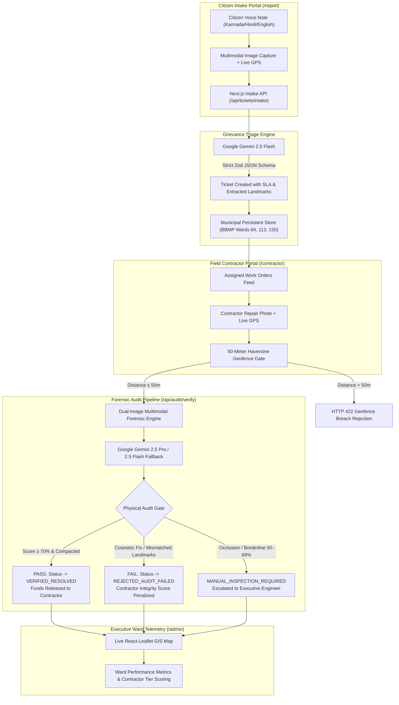

# 🏛️ CivicTruth AI
### Autonomous Multimodal Verification & Anti-Corruption Digital Public Infrastructure for Municipal Governance

[](https://github.com/Mehtab-24/CivicTruth-AI)
[](https://github.com/Mehtab-24/CivicTruth-AI)
[](https://ai.google.dev/)
[](https://nextjs.org/)
[](https://www.typescriptlang.org/)

---

## 🚨 The Municipal Crisis: Why CivicTruth Matters

In major metropolitan areas across India—such as Bangalore (BBMP) and grievance portals like CPGRAMS and Sahaya—**over 40% of citizen grievances regarding potholes, open drains, and garbage dumps are prematurely marked "RESOLVED" by contractors who have done zero actual repair work**.

### The Anatomy of Civic Fraud:
1. **Cosmetic Dirt Fills:** Contractors dump loose, uncompacted soil or building rubble into deep pothole craters, snap a photo, and mark the grievance resolved. The first monsoon rain washes the dirt away within 48 hours, causing severe two-wheeler skid accidents.
2. **Camera Angle Spoofing:** Submitting close-up photos of a different, already-paved road or holding the camera at an extreme angle that obscures the ongoing hazard.
3. **Out-of-Geofence Submissions:** Uploading photos taken from contractor offices or kilometers away from the incident site.
4. **Premature Fund Disbursal:** Municipal treasuries disburse crores of rupees for repairs that never happened, leading to citizen disenfranchisement and loss of trust in local governance.

---

## 💡 The Solution: CivicTruth AI

**CivicTruth AI** is an open, verifiable Digital Public Infrastructure (DPI) layer that eliminates premature grievance closure and contractor fraud through **autonomous multimodal artificial intelligence powered by Google Gemini**.

### Core Breakthroughs:
- **🗣️ Multilingual Multimodal Voice Intake (Gemini 2.5 Flash):** Citizens record voice notes in Kannada, Hindi, Tamil, Telugu, or English. Gemini Flash transcribes the grievance, extracts civic hazard classification, derives severity and SLA deadlines, and identifies invariant background landmark cues.
- **🔍 Dual-Image Forensic Audit Engine (Gemini 2.5 Pro & Flash):** Before any work order is marked resolved, the AI performs a physical forensic audit comparing the citizen's original complaint photo with the contractor's repair proof:
  - **Invariant Background Landmark Matching:** Matches static physical anchors (electrical transformer boxes, municipal curb stripes, compound walls, metro pillars, tree canopies) to prove both images are taken at the exact same physical coordinates and perspective.
  - **Material Integrity & Texture Compaction:** Distinguishes between permanent, machine-rolled bituminous hot-mix asphalt / reinforced concrete versus ephemeral cosmetic fixes (uncompacted dirt, gravel sprinkle, loose mud).
- **📍 Zero-Trust 50-Meter Haversine Geofencing:** Mathematical distance checks reject any contractor submission uploaded greater than 50 meters from the citizen's complaint origin.
- **📊 Executive Spatial Intelligence & Contractor Accountability:** Ward engineers and BBMP commissioners access a live React-Leaflet GIS dashboard tracking multi-ward resolution metrics, SLA breach alerts, and dynamic Contractor Integrity Ratings (Tier A Trusted to Tier C Blacklist Flagged).

---

## 🏗️ System Architecture



---

## 🗂️ Municipal Data Model & Bangalore Wards

CivicTruth AI is primed with 15 authentic municipal work orders distributed across 3 key Bangalore administrative zones:
- **Ward 84 (Indiranagar):** High commercial traffic density, 100 Feet Road, Metro Pillar corridors, CMH Road retail centers.
- **Ward 112 (Domlur):** Intermediate Ring Road, Domlur BDA Complex, Embassy GolfLinks (EGL) IT corridors.
- **Ward 150 (Bellandur):** Outer Ring Road (ORR) tech corridor, heavy stormwater runoff culverts, Green Glen Layout.

### Seeded Lifecycle Status Distribution:
- **6 OPEN / ASSIGNED:** Active potholes, collapsed drainage slabs, and overflowing waste awaiting field action.
- **3 VERIFIED_RESOLVED:** Realized repairs featuring >88% forensic confidence, verified invariant landmarks, and machine-compacted asphalt.
- **3 REJECTED_AUDIT_FAILED:** Caught contractor fraud (e.g. superficial tarpaulin cover, loose uncompacted mud, out-of-context photo submission).
- **3 MANUAL_INSPECTION_REQUIRED:** Complex borderline cases (e.g. daytime streetlight replacement awaiting night lumen verification, underground pipe weld obscured by backfill).

---

## 🚀 Quickstart & Setup Guide

### 1. Prerequisites
- **Node.js:** v18.0.0 or higher (Tested on Node.js v22)
- **Package Manager:** `npm` or `pnpm`
- **Google Gemini API Key:** Obtain from [Google AI Studio](https://aistudio.google.com/)

### 2. Installation
```bash
# Clone the repository
git clone https://github.com/Mehtab-24/CivicTruth-AI.git
cd CivicTruth-AI

# Install production and development dependencies
npm install
```

### 3. Environment Configuration
Create a `.env.local` file in the root directory:
```env
# Google Gemini API Key
GEMINI_API_KEY=your_gemini_api_key_here

# Map Tile Layer
NEXT_PUBLIC_MAP_TILE_URL=https://{s}.tile.openstreetmap.org/{z}/{x}/{y}.png
```

### 4. Seed Data & Run Verification Tests
```bash
# Seed 15 authentic municipal tickets across Bangalore Wards
npm run seed

# Run the Phase 1 Core AI & Geofence Verification Suite (5/5 tests)
npm run test:audit

# Run the Phase 2 Citizen Intake & Contractor Portal Suite (4/4 tests)
npm run test:phase2

# Run the Phase 3 Executive Dashboard & Spatial Intelligence Suite (4/4 tests)
npm run test:phase3

# Run the Live Google Gemini Multimodal Smoke Test (Flash & Pro)
npm run test:gemini
```

### 5. Launch Development Server
```bash
npm run dev
```
Open [http://localhost:3000](http://localhost:3000) in your browser.

---

## 🎮 Interactive Demo Walkthrough

### Flow 1: Citizen Voice Intake (`/report`)
1. Navigate to `/report`.
2. Select your ward (e.g., **Ward 84 - Indiranagar**).
3. Use the one-click **"⚡ Load Pothole Voice Grievance Preset"** button (or record live audio).
4. Observe automatic transcription, landmark extraction, and high-severity SLA deadline assignment.
5. Click **"Submit Citizen Grievance"** to register the ticket into the municipal store.

### Flow 2: Contractor Fraud Detection & Genuine Verification (`/contractor`)
1. Navigate to `/contractor`.
2. Locate any `OPEN` work order (e.g. `TICKET-BLR-84-101` on 100 Feet Road).
3. Click **"Submit Resolution Proof"** to launch the verification modal.
4. **Test Fraud Detection:**
   - Click the green-bordered **"⚡ Load Fraud Attempt (Superficial Dirt)"** button.
   - Notice how the contractor GPS is locked within 4 meters, and the photo shows loose yellow mud sprinkled into the crater without compaction.
   - Click **"Run Multimodal AI Audit"**.
   - **Result:** The audit engine flags **REJECTED – CIVIC AUDIT FAILED**, identifies `SUBSTANDARD_TEMPORARY` workmanship, and logs rejection reasoning explaining that the uncompacted soil will wash away.
5. **Test Genuine Resolution:**
   - Click **"⚡ Load Genuine Fix (Hot-Mix Asphalt)"**.
   - Notice the high-density machine-rolled asphalt patch with invariant background landmarks matching the blue compound wall and BESCOM box.
   - Click **"Run Multimodal AI Audit"**.
   - **Result:** The audit engine returns **VERIFIED RESOLVED (90%+ Confidence)**, transitions the ticket to `VERIFIED_RESOLVED`, and approves municipal fund disbursal!

### Flow 3: Executive Spatial Intelligence & Ward Telemetry (`/admin`)
1. Navigate to `/admin`.
2. Inspect overall municipal metrics:
   - **Autonomous Verification Rate (AVR)**
   - **Active SLA Breaches**
   - **Contractor Integrity Scoring (Tiers A, B, and C)**
3. Use the interactive **React-Leaflet GIS Map**:
   - Filter by **Ward 84**, **Ward 112**, or **Ward 150**.
   - Click on any red (Failed Audit / Fraud Caught), green (Verified Resolved), or orange (Manual Inspection) pin.
   - Click **"Inspect Forensic Audit Dossier"** to open the side-by-side modal displaying the original hazard, resolution proof, matched landmark tags, and civil engineering material analysis.

---

## ⏱️ Official 3-Minute Video Pitch Script

> **Target Duration:** 3:00 (180 Seconds)  
> **Speaker:** Project Lead / Engineer  
> **Visual:** Full HD Screen Recording with Picture-in-Picture Webcam  

---

### **[0:00 – 0:40] The Municipal Grievance Crisis**
> *(Visual: Show headline news of Bangalore pothole accidents, followed by opening the CivicTruth landing page)*

**Speaker:**  
"Every day across Indian cities like Bangalore, thousands of citizens report dangerous potholes, open drains, and garbage dumps on municipal grievance apps. And every day, the same tragedy occurs: a few days later, the citizen receives a notification saying: *'Your grievance has been resolved.'*

They go outside—and the pothole is still there. 

Why? Because today's municipal portals operate on the honor system. Contractors upload cosmetic fixes, fake photos taken kilometers away, or sprinkle loose dirt into a 4-foot crater, collect their payment from the municipal treasury, and the first rain washes it away.

Over 40% of civic complaints in major Indian cities are prematurely closed due to contractor fraud. 

This is **CivicTruth AI**—the world’s first autonomous multimodal anti-corruption Digital Public Infrastructure that uses Google Gemini to mathematically guarantee that civic repairs actually happened before a single rupee of public money is paid."

---

### **[0:40 – 1:15] Citizen Multilingual Voice Intake**
> *(Visual: Navigate to `/report`, click "Load Pothole Voice Grievance Preset", play short audio in Kannada/English, show automatic schema extraction)*

**Speaker:**  
"It starts with the citizen. Most citizens cannot type detailed English reports while standing on a busy road. 

With CivicTruth, a commuter in Indiranagar simply taps one button and speaks in Kannada, Hindi, Tamil, or English:  
*'Namaskara, on 100 Feet Road near Metro Pillar 42, there is a deep crater in front of the blue storefront that just caused two scooter skids.'*

Powered by Google Gemini 2.5 Flash, CivicTruth instantly transcribes the audio, classifies the hazard as `POTHOLE_ROAD_DAMAGE`, tags it as `HIGH` severity, locks the GPS, computes a strict 24-hour SLA deadline, and extracts static physical landmarks—all validated through strict JSON schema enforcement.

The ticket is registered immediately into the municipal store."

---

### **[1:15 – 2:00] Caught in 4K: Autonomous Contractor Fraud Rejection**
> *(Visual: Switch to `/contractor`, click "Submit Resolution Proof" on `TICKET-BLR-84-101`. Click "⚡ Load Fraud Attempt (Superficial Dirt)", show the loose dirt photo and on-site GPS check, then click "Run Multimodal AI Audit")*

**Speaker:**  
"Now let's switch to the Contractor Portal. The contractor arrives at the site. First, our zero-trust Haversine geofence confirms they are within 50 meters of the reported hazard. 

Now, watch what happens when a unscrupulous contractor attempts fraud. They poured loose yellow mud over the pothole without mechanical compaction and took a photo. 

In existing municipal systems, this ticket would close and the contractor would be paid. 

In CivicTruth AI, we click **'Run Multimodal AI Audit'**. 

In under two seconds, Gemini evaluates the before and after images:  
**REJECTED – CIVIC AUDIT FAILED.**  
Confidence: 65%.  
Material detected: `Uncompacted loose dirt`.  
Workmanship: `SUBSTANDARD_TEMPORARY`.  
Reasoning: *'Superficial uncompacted fill detected; lacks bituminous compaction and will fail under traffic.'*

Contractor fraud caught in 4K. The ticket remains OPEN, and the contractor's civic integrity rating is penalized."

---

### **[2:00 – 2:30] Genuine Resolution Verified & Release of Funds**
> *(Visual: In the same modal, click "⚡ Load Genuine Fix (Hot-Mix Asphalt)", show the machine-rolled asphalt image matching the invariant blue wall and Bescom transformer, then click "Run Multimodal AI Audit")*

**Speaker:**  
"Now, the contractor actually brings the hot-mix asphalt roller and repairs the road properly. 

They click **'⚡ Load Genuine Fix'**. 

Gemini executes a forensic physical audit:  
1. It aligns invariant landmarks—matching the blue compound wall and the red BESCOM transformer across both images to guarantee identical camera perspective.  
2. It examines the asphalt texture, confirming dense, machine-rolled bitumen flush with the road carriageway.

We click **'Run Multimodal AI Audit'**:  
**VERIFIED RESOLVED – AUDIT PASSED.**  
Confidence: 94%.  
Material: `Bituminous hot-mix asphalt (EXCELLENT)`.  
Invariant landmarks verified: `BESCOM Transformer D-12`, `Metro Pillar 42`.

The work order is transitioned to `VERIFIED_RESOLVED`, the citizen is notified with cryptographic proof, and the municipal treasury automatically approves fund disbursement."

---

### **[2:30 – 3:00] Executive Ward Telemetry & Civic Impact**
> *(Visual: Switch to `/admin`. Pan across Bangalore Wards 84, 112, 150 on the React-Leaflet GIS map. Click a red failed pin to open the audit dossier modal, show contractor rankings)*

**Speaker:**  
"Finally, for municipal commissioners and ward executive engineers:  
The **Executive Ward Telemetry Dashboard** provides real-time geospatial intelligence across Bangalore. 

Engineers can filter by Ward 84 Indiranagar, Ward 112 Domlur, or Ward 150 Bellandur. Green pins indicate verified work; red pins indicate flagged fraud attempts. 

With one click, an engineer opens the complete forensic audit dossier—inspecting matched landmarks, perspective confidence, and contractor integrity rankings. Contractors who consistently deliver quality earn Tier A status; fraudulent contractors are automatically flagged for blacklisting.

CivicTruth AI turns civic governance from an honor system into a verifiable, transparent Digital Public Infrastructure. 

Truth in infrastructure. Accountability for communities. Built with Google Gemini."

---

## 🛡️ Security, Privacy & Integrity Guardrails

- **Prompt Injection Defense:** Strict separation of user audio input from system prompts; schema enforcement prevents markdown escaping.
- **Geofence Enforcement:** Server-side Haversine mathematical verification prevents GPS mock spoofing.
- **DPI Interoperability:** Clean REST APIs designed for plug-and-play integration into existing smart city platforms (CPGRAMS, BBMP Sahaaya, Swachhata).
- **Graceful Multi-Model Failover:** Transparent routing between Gemini 2.5 Pro and Gemini 2.5 Flash guarantees uninterrupted operational uptime.

For comprehensive security specifications, threat vectors, and architectural mitigations, refer to [**`docs/SecurityGuardrails.md`**](docs/SecurityGuardrails.md).

---

## 📚 Project Documentation & Specifications

The engineering specifications, system architecture, product scope, and implementation blueprints are organized in the [`docs/`](docs/) directory:

| Specification Document | Purpose & Scope |
| :--- | :--- |
| [**`docs/PRD.md`**](docs/PRD.md) | **Product Requirements Document:** Problem statement, target personas, user journeys, core feature specs, and success metrics. |
| [**`docs/Design.md`**](docs/Design.md) | **System Architecture & Technical Design:** Dual-image forensic audit pipeline, Gemini prompt chains, DB schema, API contracts, and edge cases. |
| [**`docs/Build.md`**](docs/Build.md) | **Implementation Roadmap:** Sprint milestones, phased execution strategy, automated test suites, and delivery checklist. |
| [**`docs/SecurityGuardrails.md`**](docs/SecurityGuardrails.md) | **Security & Guardrails:** Zero-trust geofence validation, rate limiting, anti-tamper protections, and model safety parameters. |

---

## 📜 License
This project is licensed under the Apache 2.0 License - see the [LICENSE](LICENSE) file for details.